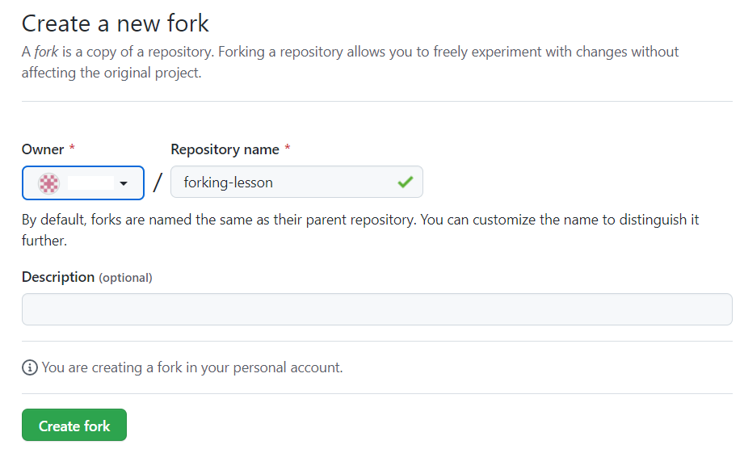

### Forking
In previous lessons, you have touched on workflows such as branching and how they can be used to simplify a process for a team. Forking is another type of workflow. The key difference between branching and forking is that the workflow for forking creates a new repository entirely. Branching cuts a new branch from the same repository each time and each member of the team works on the single repository.

Let's take a simple example of how forking works. In the diagram below the coolgame repo has been forked by Joe. The entire contents and the history of the repository are now stored in Joe's account on GitHub. Joe is now free to make edits and changes to the repository at his own will. You, the owner of the coolgame repository can continue to work as normal and not know about Joe's edits or changes.

Joe created a new branch on his repository and added a new cool feature that he felt was needed. In order for Joe to get his feature back into the original repository, he will need to create a PR as normal but instead of comparing with the main branch, it needs to be compared with the original repository. Essentially the two repositories are compared against each other. The owner of the original repository can then review the PR and choose to accept of decline the new feature.

* Forking
Let us take a look at how you can fork an existing repository that is available on GitHub. For this example, we used a repository we can access on GitHub.

* Step 1: If you have access to your own repository on GitHub, you can access this now to follow along.

* Step 2: Click on the Fork button on the top right of the page.

* Step 3: It will then prompt you to fork the repository to your desired account. Choose the account you wish to fork to.

