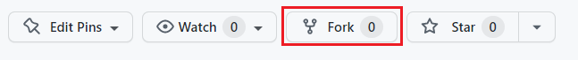
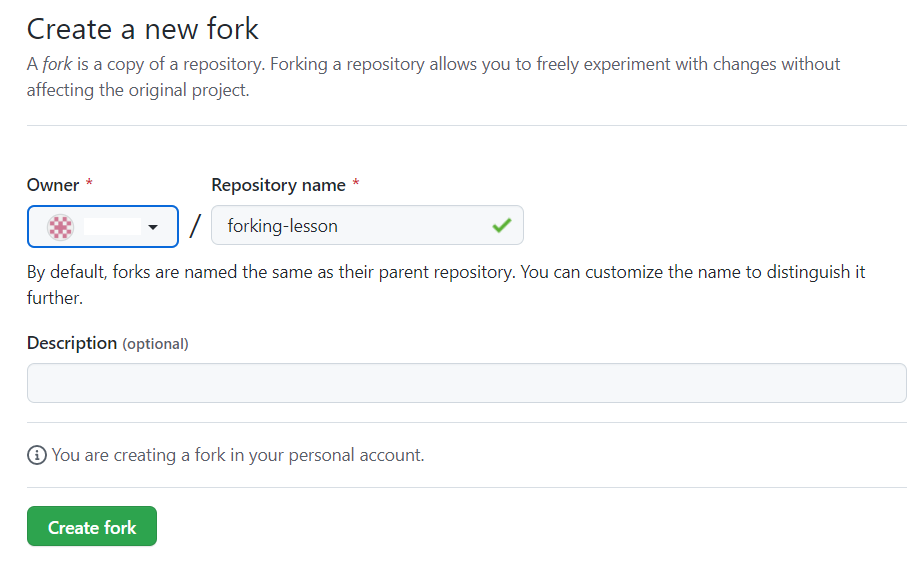
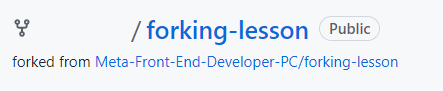
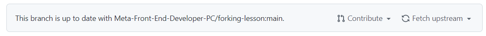
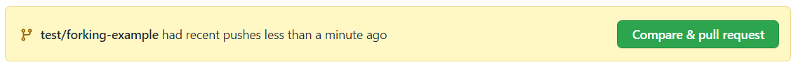
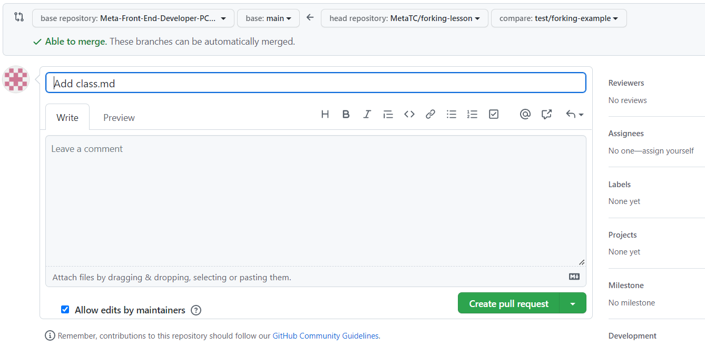

# Forking
In previous lessons, you have touched on workflows such as branching and how they can be used to simplify a process for a team. Forking is another type of workflow. The key difference between branching and forking is that the workflow for forking creates a new repository entirely. Branching cuts a new branch from the same repository each time and each member of the team works on the single repository.

Let's take a simple example of how forking works. In the diagram below the coolgame repo has been forked by Joe. The entire contents and the history of the repository are now stored in Joe's account on GitHub. Joe is now free to make edits and changes to the repository at his own will. You, the owner of the coolgame repository can continue to work as normal and not know about Joe's edits or changes.


Joe created a new branch on his repository and added a new cool feature that he felt was needed. In order for Joe to get his feature back into the original repository, he will need to create a PR as normal but instead of comparing with the main branch, it needs to be compared with the original repository. Essentially the two repositories are compared against each other. The owner of the original repository can then review the PR and choose to accept of decline the new feature.

### Forking
Let us take a look at how you can fork an existing repository that is available on GitHub. For this example, we used a repository we can access on GitHub.

***Step 1:*** If you have access to your own repository on GitHub, you can access this now to follow along.

***Step 2:*** Click on the Fork button on the top right of the page.



***Step 3:*** It will then prompt you to fork the repository to your desired account. Choose the account you wish to fork to.



***Step 4:*** Github will then clone the repository into your chosen GitHub account.

In a couple of steps, you have successfully forked a repository into our own GitHub account. The full repository is cloned and allows us to work directly in that repository as if it was our own.

On the landing page of the GitHub repository, it will show directly under the repository name that it was forked from Meta-Front-End-Developer-PC/forking-lesson.



Other subtle differences in the GitHub UI on a forked branch is the top information bar above the files.

It now shows that the branch is up to date with forking-lesson:main. It also adds a Fetch upstream drop-down to allow you to pull and merge the latest changes from the original repository.



# Example
Let's run through a typical flow of creating a new branch and adding some new content.

**Step 1:** Clone the repository.

***Step 2:*** Create a new branch.

```console
git checkout -b test/forking-example
```

***Step 4:*** Create a new file and commit it to the repository.

```console
touch text.txt
git add . 
git commit -m 'chore: testing'
```

***Step 5*** Push the branch to your remote repository.

```console
git push -u origin test/forking-example
```

***Step 6:*** Go to Github and click the Compare & pull request button. If it's not available, click on the branch dropdown button and change it from main to the branch name of test/forking-example:

After clicking the Compare & pull request button it will now redirect to the original repository in order to create the PR.



Each repository will have its own guidelines for submitting PRs against them and usually provide a how-to contribute guide. As you can see, in order to get the changes from our forked repository, you need to compare it against the original. This gives a lot of control to the repository owners of the original and they get to decide what makes the cut to be merged in.

In this lesson you covered the basics of forking a repository, adding some changes, and then creating a PR to get it back to the original repository.

