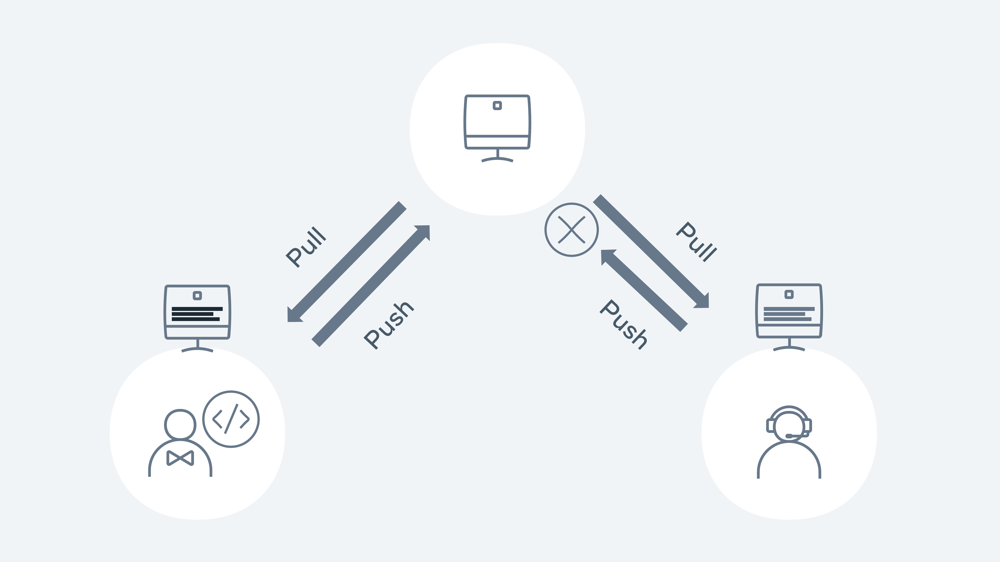

Resolving conflicts
Conflicts will normally occur when you try to merge a branch that may have competing changes. Git will normally try to automatically merge (auto-merge), but in the case of a conflict, it will need some confirmation. The competing changes need to be resolved by the end user. This process is called merging or rebasing. 

The developer must look at the changes on the server and their local and validate which changes should be resolved.

A merge conflict example is when two developers work on their dependent branches. Both developers are working on the same file called Feature.js. Each of their tasks is to add a new feature to an existing method. Developer 1 has a branch called feature1, and developer 2 has a branch called feature2. 

Developer 1 pushes the code with the changes to the remote repository. Developer 2 pushes their changes.

Demonstration of the push pull method

Let's walk through how this would happen in Git. Both developers 1 and 2 check out the main repository on Monday morning. They both have the same copy. Both developers check out a new branch - feature 1 and 2.